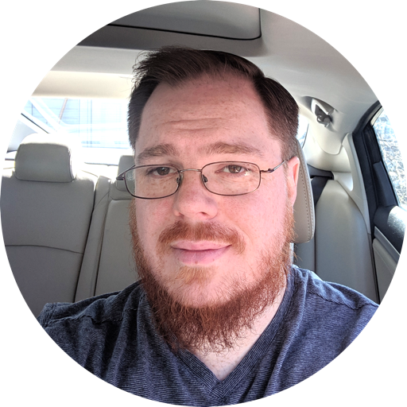

Title: About
Sortorder: 20
Date: 2023-10-21 19:38
Summary: Hi there, I'm Samuel Colburn. Sardine Sound is my side-gig. I get a lot of help hauling gear around from my spouse Val. We've worked together to bring sound to community theater productions and various events since 2016.

Hi there, I'm Samuel Colburn, a software engineer by day. Sardine Sound is my side-gig. I get a lot of help hauling gear around from my spouse Val. We've worked together to bring sound to community theater productions and various events since 2016.

I was heavily engaged in theater (both technical and on stage) in high school and continued my technical theater pursuits in college for a year or two, after which I set it aside to lean in more on hobbies related to programming and networking. About a decade later, in 2016, my spouse convinced me to get back into technical theater because their production of Godspell needed someone to run the mixer. After that first show back at the board, I was hooked again. I invested in some live audio equipment to improve my capabilities and have been mixing audio for community theater, local schools, and small events in the area ever since.

### Why "Sardine"?

In late 2023 I decided to give this side-gig a name so I could have an easy-to-remember web domain to direct people to. Why did I choose "Sardine"? I love sardines, it's an easy word to spell, and the resulting name is alliterative. I'm also a very small sound operation; there are much bigger fish in the profession. Sometimes, if a booth in a theater is small enough, I even feel like I'm a sardine.
